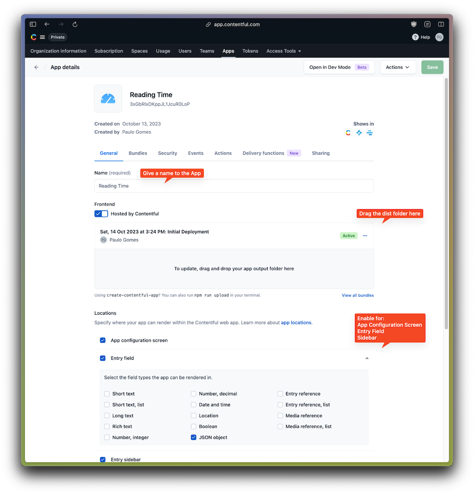

# Contentful Reading Time Field

This simple Contentful App offers the capability to calculate and store a reading time value along with an entry, making it especially useful for blog post articles.

The calculation is derived from a single entry field, whether it's Rich Text or Long Text. It takes into consideration the number of words, assets, and embedded entries, providing an efficient way to estimate reading time for your content.

```
wordsPerMinute = 225 (avg of most people)
assetsPerSecond = 10
entriesPerSecond = 10

Reading Time (min) = (totalWords * wordsPerMinute) + (totalAssets * assetsPerSecond / 60) + (totalEmbeddedEntries * entriesPerSecond / 60)
```

The resulting calculation is stored in the entry in a JSON field like the following example:

```json
{
	"readingTime": {
		"en-US": {
			"text": "3 min read"
			"time": 178133
			"words": 668
			"assets": 7
			"entries": 1
			"minutes": 4.3
		}
	}
}
```

## ▶️ Demo

https://github.com/pauloamgomes/contentful-readingtime-field-app/assets/102261/cbaa555e-acb8-45a3-84ee-571a7f8f5b78

Keep in mind that the accuracy of this formula might vary, particularly due the types of the embedded entries you have. However, you have the flexibility to tweak the values in the configuration, and manually override the calculated reading time within the entry.

## 🛠 Setup

Install the App by doing the below steps:

1. Create a new Contentful custom App and define the Application Name (e.g. Reading Time)

2. Download this repo and drag the dist folder into the Bundles upload zone:
   You can find more details about hosting an [Contentful app here](https://www.contentful.com/developers/docs/extensibility/app-framework/hosting-an-app/)

3. Set the App configuration screen and Field locations (JSON Object field):



4. Create one instance parameter

- Help Text: Type "Text", Display name "Body Text Field ID", and id "bodyText" (exactly as per below screenshot):


5. Save, and Install the App in your space, you'll see the configuration screen:


6. Go to the Content Model you want to use the Reading Time, create a new JSON Object field and select the App in the Appearance tab.
And Set the source text field to be used for the calculation.


7. Open or create a new entry of that Content Model and see it in action


## 🥷 Development

Clone this Repo and install dependencies `pnpm install`

In the project directory, you can run:

#### `pnpm run start`

Creates or updates your app definition in Contentful, and runs the app in development mode.
Open your app to view it in the browser.

The page will reload if you make edits.
You will also see any lint errors in the console.

#### `pnpm run build`

Builds the app for production to the `dist` folder.
It correctly bundles React in production mode and optimizes the build for the best performance.

The build is minified and the filenames include the hashes.
Your app is ready to be deployed!

#### `pnpm run upload`

Uploads the `dist` folder to Contentful and creates a bundle that is automatically activated.
The command guides you through the deployment process and asks for all required arguments.
Read [here](https://www.contentful.com/developers/docs/extensibility/app-framework/create-contentful-app/#deploy-with-contentful) for more information about the deployment process.

#### `pnpm run upload-ci`

Similar to `npm run upload` it will upload your app to contentful and activate it. The only difference is
that with this command all required arguments are read from the environment variables, for example when you add
the upload command to your CI pipeline.

For this command to work, the following environment variables must be set:

- `CONTENTFUL_ORG_ID` - The ID of your organization
- `CONTENTFUL_APP_DEF_ID` - The ID of the app to which to add the bundle
- `CONTENTFUL_ACCESS_TOKEN` - A personal [access token](https://www.contentful.com/developers/docs/references/content-management-api/#/reference/personal-access-tokens)

## Learn More

This project was bootstrapped with [Create Contentful App](https://github.com/contentful/create-contentful-app) using the vite-react example, and using pnpm as package manager.

## Copyright and license

Copyright 2023 pauloamgomes under the MIT license.